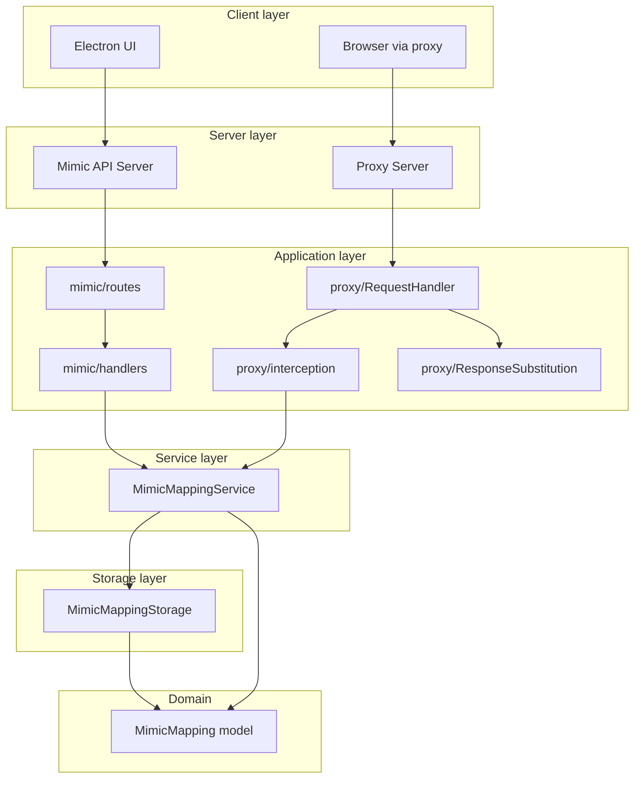

# Architecture

## Overview

The server side of Mimic Chest Proxy runs two separate processes:

1. **Mimic API server** — Express HTTP server that exposes REST endpoints to manage *mappings* (URL pattern → replacement content). Used by the Electron UI and by external clients.
2. **MITM proxy server** — HTTP/HTTPS proxy (using `http-mitm-proxy`) that forwards client traffic to the origin. When a response matches a mapping (by URL and content-type), the proxy replaces the response body with the mimicked content.

Both servers start together and share the same *mapping service* and *storage*. The proxy does not serve the API; it only forwards traffic and performs content substitution when a mapping matches.

## Component diagram

## Where things live

| Concern | Location |
|--------|----------|
| API routes and handlers | `src-server/mimic/` (routes.ts, handlers.ts) |
| Proxy lifecycle and hooks | `src-server/proxy/` (ProxyServer.ts, RequestHandler.ts) |
| Interception policy and substitution | `src-server/proxy/` (interception.ts, ResponseSubstitution.ts, sendMimickedContent.ts) |
| Mapping finder interface and types | `src-server/proxy/` (interception.ts, types.ts) |
| Business logic (CRUD, find by URL) | `src-server/service/MimicMappingService.ts` |
| Persistence (index + content files) | `src-server/storage/MimicMappingStorage.ts` |
| Domain model | `src-server/models/MimicMapping.ts` |

## Startup

Entry point is `startServers(userDataPath)` in `src-server/index.ts`. It:

1. Initializes `MimicMappingService` with the given storage path (e.g. Electron user data).
2. Starts the Mimic API server (Express, random port).
3. Starts the Proxy server (http-mitm-proxy, random port).

The Electron main process calls `startServers` and then configures the system/browser to use the proxy (e.g. Safari/Chrome with the proxy URL and CA).
