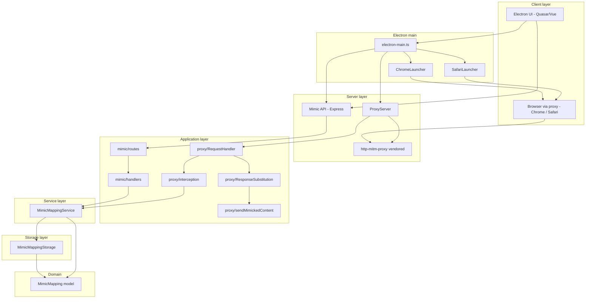

# Architecture

## Overview

Mimic Chest Proxy is an **Electron desktop app** that runs two server-side processes and a **Quasar/Vue** frontend:

1. **Mimic API server** — Express HTTP server that exposes REST endpoints to manage *mappings* (URL pattern → replacement content). Used by the Electron UI and by external clients.
2. **MITM proxy server** — HTTP/HTTPS proxy built on a **vendored** `http-mitm-proxy`. It forwards client traffic to the origin and, when a response matches a mapping (by URL and content-type), replaces the response body with the mimicked content.

The **Electron main process** starts both servers, hosts the UI in a `BrowserWindow`, and provides **browser launchers** (Chrome, Safari) that configure the system or browser to use the proxy and trust the generated CA.

Both servers share the same *mapping service* and *storage*. The proxy does not serve the API; it only forwards traffic and performs content substitution when a mapping matches.

---

## Project layout

| Path | Description |
|------|-------------|
| **`src/`** | Quasar/Vue frontend: pages, components, router, stores (mimic-store), boot (e.g. axios). Rendered in Electron’s `BrowserWindow`. |
| **`src-electron/`** | Electron main process and preload: `electron-main.ts` (starts servers, IPC, window), `electron-preload.ts` (exposes API to renderer), `ChromeLauncher.ts`, `SafariLauncher.ts`. |
| **`src-server/`** | Backend: Mimic API (Express) and proxy layer. Entry: `startServers()` in `index.ts`. |
| **`http-mitm-proxy/`** | Vendored MITM proxy source (TypeScript). Used only by the Electron main bundle; not by the web build. |
| **`docs/`** | Architecture, proxy flow, Mimic API, data flow. |
| **`scripts/`** | Helpers (e.g. `generate-certs.sh`, `ensure-electron.js`). |
| **`test/`** | Standalone proxy test (`simple-proxy.js`), Chrome launch scripts. |
| **`public/`** | Static assets (favicon, icons). |
| **`quasar.config.ts`** | Quasar/Vite config; Electron main is built with esbuild (alias + Node externals for `http-mitm-proxy`). |

---

## Component diagram

---

## Where things live

### Frontend (`src/`)

| Concern | Location |
|--------|----------|
| App shell, router | `App.vue`, `router/` |
| Pages | `pages/` (e.g. `IndexPage.vue`) |
| Mappings UI | `components/` (MappingsList, MappingsEditorLayout, CodeEditor, ContentEditorSection, UrlInputSection) |
| State | `stores/mimic-store.ts` |
| Boot | `boot/axios.ts` |
| Styles | `css/`, `layouts/` |

### Electron (`src-electron/`)

| Concern | Location |
|--------|----------|
| Main process | `electron-main.ts` — creates window, calls `startServers()`, IPC handlers (`launch-mimic-chrome`, `launch-mimic-safari`, etc.), app lifecycle |
| Preload | `electron-preload.ts` — exposes safe API to renderer (e.g. launch browser, get ports) |
| Chrome with proxy | `ChromeLauncher.ts` — spawns Chrome with `--proxy-server` and `--ignore-certificate-errors` |
| Safari with proxy | `SafariLauncher.ts` — uses `networksetup` for system proxy, adds CA to keychain, restores state on close |

### Server (`src-server/`)

| Concern | Location |
|--------|----------|
| Entry, startup | `index.ts` — `startServers(userDataPath)`, exports `getProxyCaDir`, `mimicMappingService`, logger |
| Mimic API | `mimic/` — `routes.ts`, `handlers.ts`, `index.ts` (Express app, random port) |
| Proxy lifecycle | `proxy/ProxyServer.ts` — creates http-mitm-proxy instance, `onRequest` / `onResponse`, gunzip, error handling |
| Request/response handling | `proxy/RequestHandler.ts` — `handleRequest`, `handleResponse` |
| Interception policy | `proxy/interception.ts` — `getInterceptionDecision()` (URL, mapping, content-type) |
| Substitution | `proxy/ResponseSubstitution.ts` — `onResponseHeaders`, `onResponseData`, `onResponseEnd`; sends mimicked content on first chunk |
| Sending body | `proxy/sendMimickedContent.ts` — writes headers (if not sent) and body to `proxyToClientResponse` |
| Proxy types | `proxy/types.ts` — `MitmProxyContext`, `MitmProxyInstance` |
| Business logic | `service/MimicMappingService.ts` — CRUD, `findMatchingMapping` |
| Persistence | `storage/MimicMappingStorage.ts` — index + per-mapping content files |
| Domain model | `models/MimicMapping.ts` |
| Utils | `utils/` — url-parser, content-type, body-parser, console-silencer, logger |

### Vendored proxy (`http-mitm-proxy/`)

| Concern | Location |
|--------|----------|
| Core proxy | `proxy.ts` — HTTP/HTTPS server, CONNECT, request/response pipeline, `_onResponseHeaders` (includes `ctx.onResponseHeadersHandlers`), filters |
| Request/response filters | `ProxyFinalRequestFilter.ts`, `ProxyFinalResponseFilter.ts` — pipe through `_onRequestData` / `_onResponseData`; response filter skips write/end if response already finished |
| Middleware | `middleware/gunzip.ts`, `middleware/wildcard.ts` |
| CA for HTTPS | `ca.ts` — generate/load CA and certs |
| Types | `types.ts` — `IContext`, `IProxy`, callbacks (e.g. `OnRequestParams`, `OnWebSocketFrameParams`) |
| Entry | `index.ts` — exports `Proxy` |

The Electron main bundle (esbuild) resolves `http-mitm-proxy` to `http-mitm-proxy/index.ts` and marks Node built-ins (e.g. `http`, `https`, `net`) as external so the bundle runs correctly in Node.

---

## Startup

1. **Electron** starts; `electron-main.ts` runs.
2. **`startServers(userDataPath)`** (`src-server/index.ts`) is called with the Electron user data path:
   - **MimicMappingService** is initialized with that path (persistence under `{userDataPath}/mimic/`).
   - **Mimic API** starts (Express on a random port).
   - **Proxy** starts (`ProxyServer` → http-mitm-proxy on a random port, with `sslCaDir` for CA/certs).
3. The **main window** loads the Quasar app (dev: Vite dev server; prod: built files).
4. User can **launch Chrome or Safari** via the UI; the launcher sets the proxy (and, for Safari, system proxy + CA) and opens the browser so traffic goes through the proxy.

---

## Build and runtime

- **Frontend**: Quasar/Vite builds the Vue app (SPA). Served in dev; packed as static files in production Electron.
- **Electron main (and preload)**: Built with **esbuild** via Quasar. The main bundle includes `src-server` and the vendored `http-mitm-proxy` (alias in `quasar.config.ts`). Node built-ins are externalized so `require('http')` etc. work at runtime.
- **Mimic API and proxy** run inside the Electron main process; they are not separate Node processes.

---

## Related docs

| Document | Description |
|----------|-------------|
| [Proxy flow](proxy-flow.md) | How the proxy handles requests/responses, when interception is decided, and how content is substituted (including first-chunk send and header override). |
| [Mimic API](mimic-api.md) | REST API for mappings and content. |
| [Data flow](data-flow.md) | How mappings are created, stored, and used by the proxy. |
