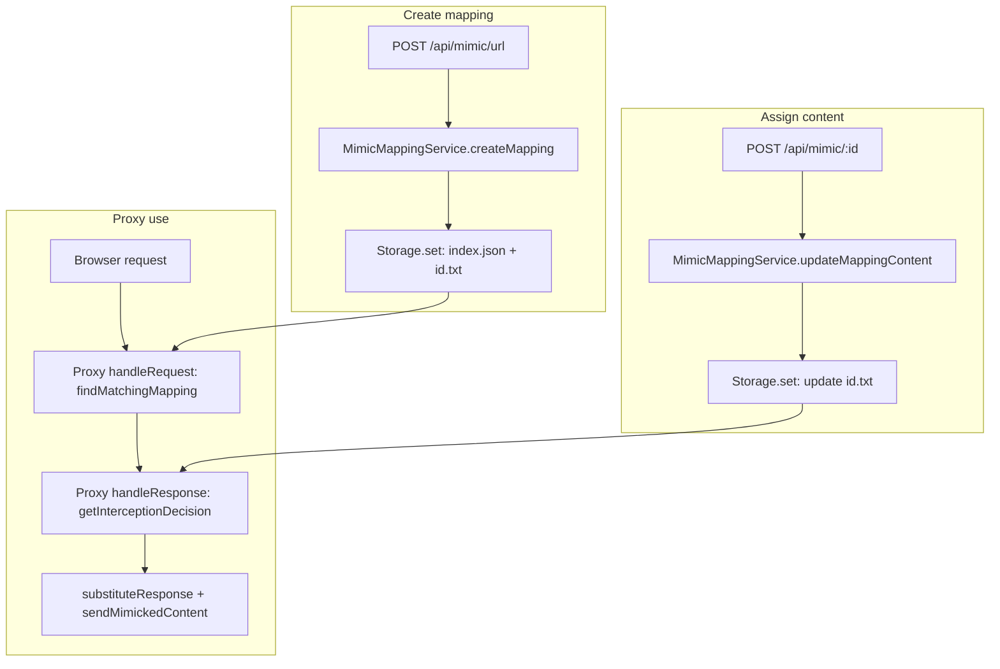

# Data flow

This document describes how mappings are created, stored, and used by the proxy to replace responses.

## Creating a mapping and assigning content

1. Client calls `POST /api/mimic/url` with `{ "pattern": "https://example.com/**" }`.
2. **MimicMappingService.createMapping** checks if a mapping with the same pattern already exists; if so, it updates that mapping. Otherwise it creates a new `MimicMapping` with a generated UUID.
3. The mapping is saved via **MimicMappingStorage.set(id, mapping)**:
   - In-memory map is updated.
   - Metadata (id, pattern, contentLength) is written to `index.json`.
   - If the mapping has content, it is written to `{id}.txt` (UTF-8).
4. Client calls `POST /api/mimic/:id` with the replacement body (e.g. HTML or JS as plain text).
5. **MimicMappingService.updateMappingContent** loads the mapping, sets `mapping.content`, and calls **storage.set** again so the new content is persisted to `{id}.txt`.

## Persistence layout

- **Directory**: `{userDataPath}/mimic/` (e.g. Electron app user data).
- **index.json**: Array of mapping metadata (id, pattern, contentLength). No content.
- **{id}.txt**: One file per mapping that has content; UTF-8 text.

Content is loaded on demand when a mapping is fetched by id (e.g. for the API) or when the proxy finds a matching mapping and needs to substitute (via findMatchingMappingAsync).

## How the proxy uses mappings

1. **Request phase**: For each request, the proxy (via **RequestHandler**) may call **finder.findMatchingMapping(url)**. 
2. **Response phase**: When the origin responds, **getInterceptionDecision(ctx, finder)** runs:
   - Extracts target URL from the proxy context.
   - Calls **finder.findMatchingMappingAsync(targetUrl)** to find and load content.
   - If a mapping is found with content and the response is HTML/JS, returns an **InterceptionDecision**.
3. **Substitution**: **substituteResponse** swallows the response body chunks and, in **onResponseEnd**, calls **sendMimickedContent** with the mapping’s content. The client receives the mimicked content instead of the origin’s response.

## Matching order

When resolving a URL to a mapping, all mappings with a **glob pattern** are checked (via picomatch). First match wins.
