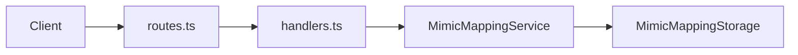

# Mimic API

The Mimic API is an Express server that provides REST endpoints to manage URL→content mappings. The Electron UI (and other clients) use it to create mappings, assign content, and list or delete them.

## Endpoints

| Method | Path | Description |
|--------|------|-------------|
| GET | `/health` | Health check. Returns `{ "status": "ok" }`. |
| GET | `/api/mimic` | List all mappings (metadata only: id, pattern/regexPattern, hasContent, contentLength). |
| GET | `/api/mimic/:id` | Get one mapping by id, including content (as UTF-8 text). |
| POST | `/api/mimic/url` | Create a mapping. Body: `{ "pattern"?: string, "regexPattern"?: string }`. Returns `{ "id", "pattern"? \| "regexPattern"? }`. |
| POST | `/api/mimic/:id` | Set or update the replacement content for a mapping. Body: plain text (e.g. HTML, JS). Returns `{ "success", "id", "contentLength" }`. |
| DELETE | `/api/mimic/:id` | Delete a mapping. Returns `{ "success", "id" }`. |

All JSON error responses include `error` and optionally `details`.

## Request/response flow

- **routes.ts** — Binds URL paths to handler functions.
- **handlers.ts** — Implements each handler: parses request, calls the service, sends JSON response.
- **MimicMappingService** — Business logic: create mapping, get by id, get by URL, update content, delete, list. Uses storage for persistence.
- **MimicMappingStorage** — Persists mappings (index.json for metadata, `{id}.txt` for content).

## Content types

- Create mapping: `POST /api/mimic/url` with JSON body `{ "pattern" }` or `{ "regexPattern" }`.
- Set content: `POST /api/mimic/:id` with body as **plain text** (e.g. `Content-Type: text/plain` or JSON string). The server accepts both JSON and text bodies and treats the payload as the replacement content (HTML, JavaScript, etc.).
