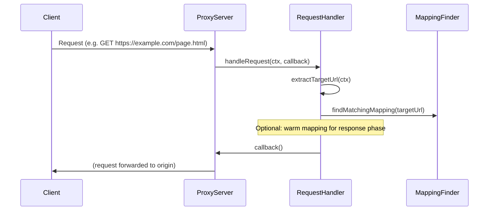
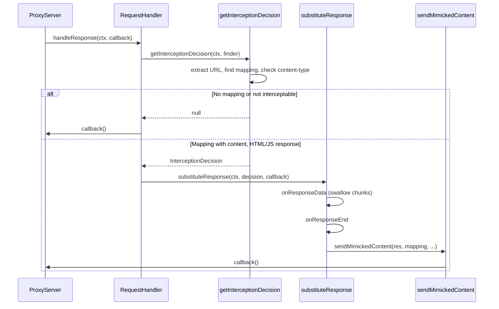

# Proxy flow

The proxy handles every request and response that passes through it. Content substitution happens only in the **response** phase, when the origin has already responded and we decide whether to replace that response with mimicked content.

## Request phase (`handleRequest`)

In the request phase the proxy:

1. Extracts the target URL from the client request (host, path, protocol).
2. Optionally looks up a matching mapping (e.g. to warm the mapping in memory for the response phase).
3. Forwards the request to the origin (no URL redirection; patterns are for content substitution only).

## Response phase (`handleResponse`)

In the response phase the proxy:

1. Gets an **interception decision**: extract URL, find mapping, check that the mapping has content and that the response content-type is interceptable (HTML or JavaScript).
2. If no decision (no match or not interceptable), the response is passed through unchanged.
3. If there is a decision, **response substitution** runs: response headers are adjusted (e.g. remove `content-length`), response body chunks are swallowed, and when the response ends the proxy sends the mimicked content to the client.

## Interception policy

Interception is allowed only when:

- The response has a matching mapping (glob or regex) for the request URL.
- The mapping has content (replacement body) set.
- The response `Content-Type` is one of: `text/html`, `application/javascript`, `text/javascript`.

The logic lives in `getInterceptionDecision()` in `src-server/proxy/interception.ts`. The actual substitution (headers, chunk swallowing, writing mimicked content) lives in `substituteResponse()` in `src-server/proxy/ResponseSubstitution.ts` and `sendMimickedContent()` in `src-server/proxy/sendMimickedContent.ts`.
