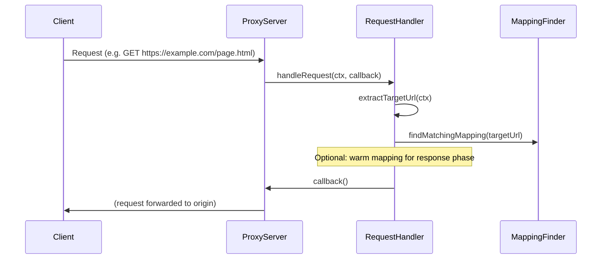

# Proxy flow

The proxy handles every request and response that passes through it. Content substitution happens only in the **response** phase, when the origin has already responded and we decide whether to replace that response with mimicked content.

## Request phase (`handleRequest`)

In the request phase the proxy:

1. Extracts the target URL from the client request (host, path, protocol).
2. Optionally looks up a matching mapping (e.g. to warm the mapping in memory for the response phase).
3. Forwards the request to the origin (no URL redirection; patterns are for content substitution only).



## Response phase (`handleResponse`)

In the response phase the proxy:

1. Gets an **interception decision**: extract URL, find mapping, check that the mapping has content and that the response content-type is interceptable (HTML or JavaScript).
2. If no decision (no match or not interceptable), the response is passed through unchanged.
3. If there is a decision, **response substitution** runs:
   - **onResponseHeaders**: override upstream headers so the client receives correct `Content-Length` and `Content-Type` for the mimicked body (and remove `content-encoding` / `transfer-encoding`).
   - **onResponseData**: on the **first** chunk, send the mimicked content to the client immediately (avoids client closing the connection before body is sent); all chunks are swallowed (no upstream body is forwarded).
   - **onResponseEnd**: if no chunk was received (empty upstream body), send mimicked content here; otherwise just finish. The vendored proxy’s response filter does not write/end again if the response is already finished.

```mermaid
sequenceDiagram
  participant ProxyServer
  participant RequestHandler
  participant Interception as getInterceptionDecision
  participant ResponseSub as substituteResponse
  participant Send as sendMimickedContent

  ProxyServer->>RequestHandler: handleResponse(ctx, callback)
  RequestHandler->>Interception: getInterceptionDecision(ctx, finder)
  Interception->>Interception: extract URL, find mapping, check content-type

  alt No mapping or not interceptable
    Interception-->>RequestHandler: null
    RequestHandler->>ProxyServer: callback()
  else Mapping with content, HTML/JS response
    Interception-->>RequestHandler: InterceptionDecision
    RequestHandler->>ResponseSub: substituteResponse(ctx, decision, callback)
    ResponseSub->>ResponseSub: onResponseHeaders (set Content-Length, Content-Type)
    Note over ResponseSub: Proxy writeHead uses these headers
    ResponseSub->>ResponseSub: onResponseData (first chunk → send mimicked; swallow all)
    ResponseSub->>Send: sendMimickedContent(res, mapping, ...)
    ResponseSub->>ResponseSub: onResponseEnd (send if not yet sent, else just callback)
    Send->>ProxyServer: callback()
  end
```

## Interception policy

Interception is allowed only when:

- The response has a matching mapping (glob or regex) for the request URL.
- The mapping has content (replacement body) set.
- The response `Content-Type` is one of: `text/html`, `application/javascript`, `text/javascript`.

The logic lives in `getInterceptionDecision()` in `src-server/proxy/interception.ts`. The substitution is implemented in `substituteResponse()` in `src-server/proxy/ResponseSubstitution.ts` (onResponseHeaders, onResponseData, onResponseEnd) and `sendMimickedContent()` in `src-server/proxy/sendMimickedContent.ts`. The vendored proxy (`http-mitm-proxy`) was patched so that `_onResponseHeaders` runs `ctx.onResponseHeadersHandlers` as well as the global handlers, and `ProxyFinalResponseFilter` skips write/end when the response is already finished (to avoid "write after end" when substitution has already sent the body).
